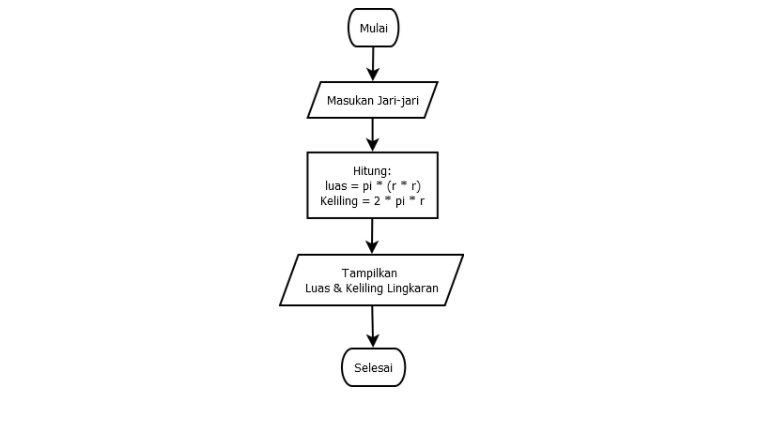
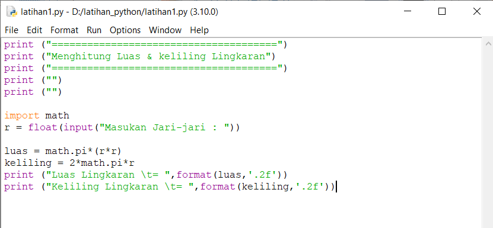
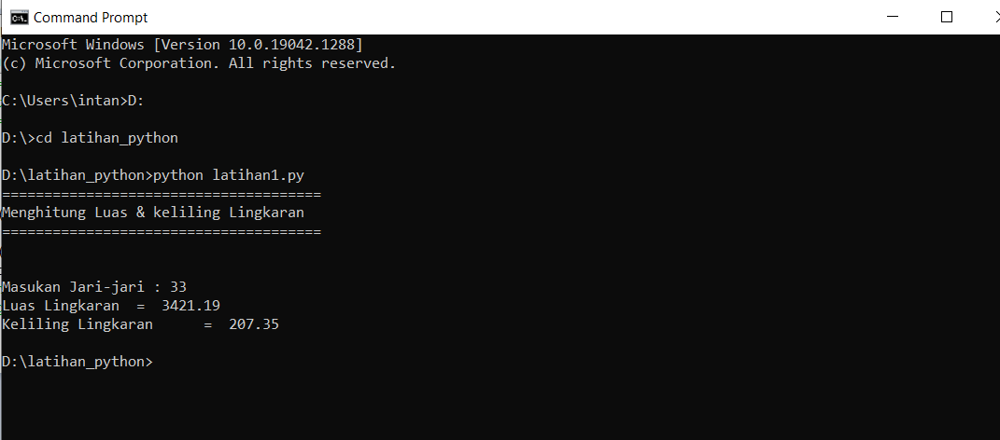
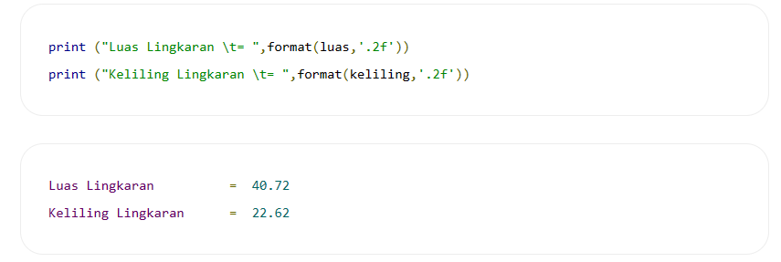

# lat_python

## Flowchart Program menghitung luas & keliling Lingkaran

## Program Python Menghitung Luas & Keliling Lingkaran
Rumus Luas & Keliling Lingkaran 

Luas     = π × r² 

Keliling = 2 x π × r 

Nilai Phi yang akan kita gunakan adalah 3.14 

r merupakan jari-jari lingkaran

### input

### Output

### Penjelasan
Program diatas saya mengimport modul math yang sudah di sediakan oleh python. Fungsinya supaya saya dapat menyertakan nilai phi yang sudah tersedia dalam modul tersebut dengan perintah math.pi jika kita coba mencetak fungsi tersebut maka akan menghasilkan nilai 3.14.

#### untuk mengambil 2 angka pecahan saja kita pakai fungsi format() seperti berikut: 

sintak \t merupakan karakter espace yang berfungsi untuk membuat tab. dalam kasus ini agar sejajar karakter sama dengan (=) nya. 

sedangkan  penggunaan fungsi format(luas,’.2f’) akan menghasilkan 2 angka pecahan saja. 

Sekian pembahasan mengenai contoh program menghitung luas dan keliling lingkaran. 

terimakasih :) 
 